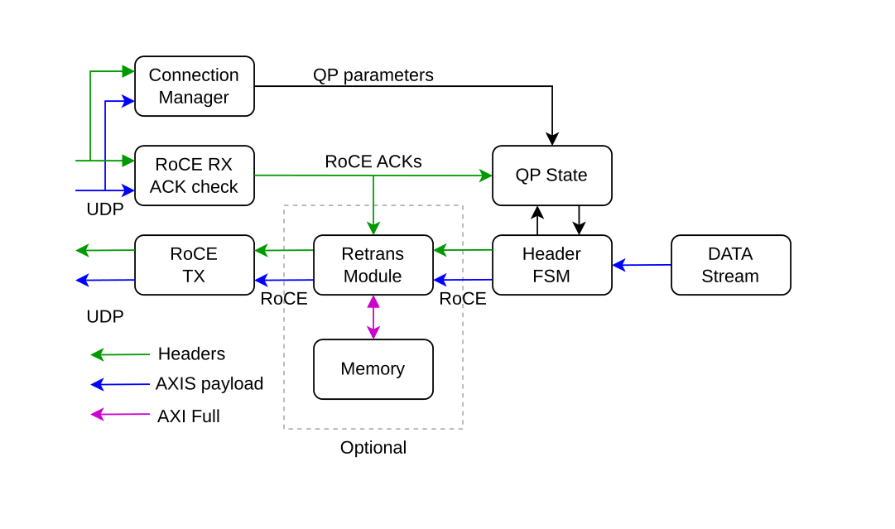
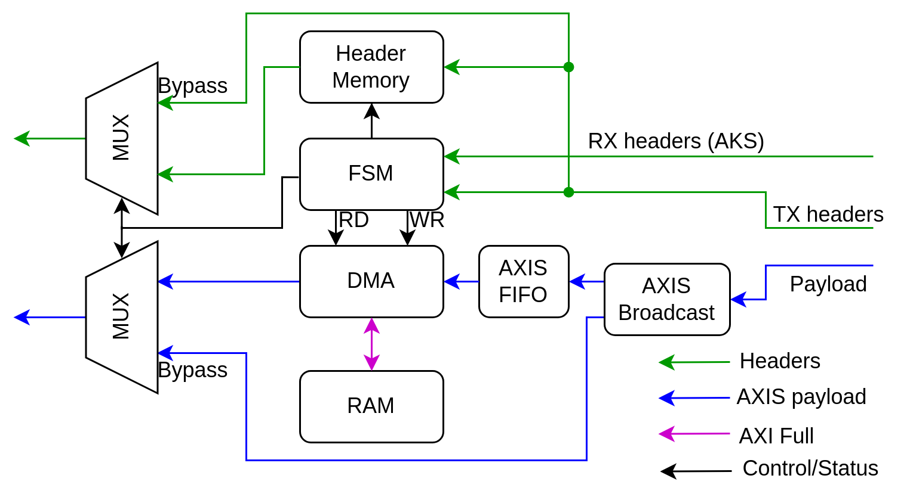

# 100G-verilog-RoCEv2-lite

!!!! Based Alex Forencich code !!!!

TX only RoCEv2. Super stripped down version of a RoCEv2 endpoint.
Up to now only RC RDMA WRITE and RC SEND with and without IMMEDIATE for both. RX part is there only to read ACKs and NAKs.

## TX diagram

    

## Retransmission diagram

    

## Connection manager via UDP
A Connection Manager (CM) is implemented via UDP packets. The structure of the UDP packet can be found [here](https://github.com/Gabriele-bot/100G-verilog-RoCEv2-lite/blob/main/rtl/connection_manager/udp_RoCE_connection_manager_rx.sv#L10-L39). An example script can be found here [Scripts/send_connection_info.py](Scripts/send_connection_info.py).

To open a connection use the following command:
`python3 send_connection_info.py -il '22.1.212.11' -ir '22.1.212.10' -lr 537 -lq 17 -la 139795697803264 -lp 0 -r 1`
Where
* `il` is the local IP address
* `ir` is the remote IP address
* `lr` is the local R_KEY
* `lq` is the local QP number
* `la` is the local Virtual Address
* `lp` is the local starting PSN
* `r` is the request code in this case is `REQ_OPEN_QP`

The FPGA will reply with its own local parameters, the only relevant one is its QP number and should be starting from 256.
The the QP needs to be modified to RTS to do so run the command:
`python3 send_connection_info.py -il '22.1.212.11' -ir '22.1.212.10' -lr 537 -lq 17 -la 139795697803264 -lp 0 -rq 256 -r 3`
* `rq` is the remote QP number given by the FPGA
* `r` in this case in `REQ_MODIFY_QP_RTS`

Once the QP is in RTS state it is possible to start sending data, as a debug it you can run this command that will instruct the FPGA to send dummy data on that QP (if it is in RTS state):
`python3 send_connection_info.py -ir '22.1.212.10' -il '22.1.212.11' -rq 256 -r 0 -s -l 16000 -n 100`
* `rq` is the remote QP number given by the FPGA
* `r` in this case in `REQ_NULL`
* `s` start transfer
* `l` is the length of a single transfer (must be multiple of 4)
* `n` is the number of transfers

Eventually the QP must be closed and its QP number must be made availabel again, to do so run the command:
`python3 send_connection_info.py -il '22.1.212.11' -ir '22.1.212.10' -lr 537 -lq 17 -la 139795697803264 -lp 0 -rq 256 -r 4`
* `rq` is the remote QP number given by the FPGA
* `r` in this case in `REQ_CLOSE_QP`

Every command that act on the QP's state will produce an ACK or an error:
* ACK will reply with the code `REQ_SEND_QP_INFO`
* Error will reply with the code `REQ_ERROR`
* The ACK contains the local and remote information stored in the FPGA QP memory, E.G. Local adn Remote QPN, R_KEY, ADDR, IP ADDR 

## TODO list

Still Work In Progress, many things need to be adjusted:
- [x] QP state module need to be updated
- [ ] Add UDP checksum checker and producer for the CM path 
- [ ] Modify RX and TX to support variable datapath width. 64, 128, 256, 512, 1024 bits
- [x] Optimize mask fields, now takes far too many LUTS (11k-15k)
	- New CRC32 module written in SystemVerilog, [here](https://github.com/UofT-HPRC/Tbps_CRC)
- [ ] Migth be useful to add UC RDMA WRITE
- [x] Finish retransmission module
    - What about mutiple QPs? 
